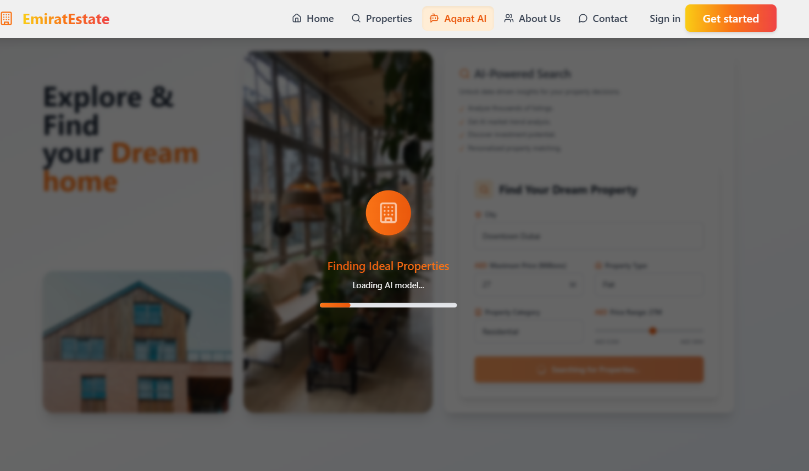
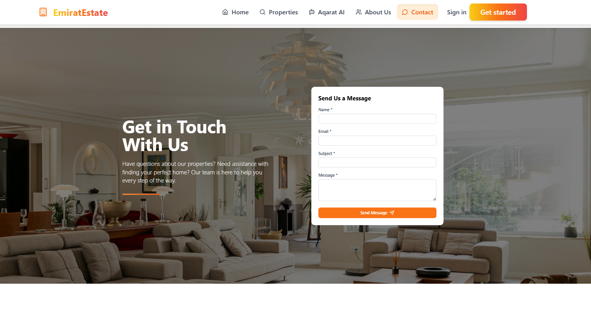

## 📋 Project Overview

A real estate platform

## 🚀 Getting Started

### System Requirements

- **Node.js**: v16.0.0 or higher
- **npm** or **yarn**: Latest stable version
- **MongoDB**: v4.4 or higher (local or Atlas)
- **API Keys**: Hugging Face API Key, FirecrawlJS, OpenAI (optional)
- **Storage**: At least 500MB free disk space

### ⚙️ Installation

<details>
<summary><b>Step 1: Clone the repository</b></summary>

```bash
git clone https://github.com/sirine707/Real-Estate.git
cd Real-Estate-Website
```

</details>

<details>
<summary><b>Step 2: Environment configuration</b></summary>

Create the following environment files with these required variables:

**Backend (.env)**

```env
PORT=4000
MONGO_URI=your_mongodb_connection_string
JWT_SECRET=your_jwt_secret_here
EMAIL=your_email_for_notifications
PASSWORD=your_email_password
FIRECRAWL_API_KEY=your_firecrawl_api_key
HUGGINGFACE_API_KEY=your_huggingface_api_key
NODE_ENV=development
IMAGEKIT_PUBLIC_KEY=your_imagekit_public_key
IMAGEKIT_PRIVATE_KEY=your_imagekit_private_key
IMAGEKIT_URL_ENDPOINT=your_imagekit_url_endpoint
ADMIN_EMAIL=admin@EmiratEstate.com
ADMIN_PASSWORD=admin123
WEBSITE_URL=http://localhost:5173
GEMINI_API_KEY=your_gemini_api_key
GROQ_API_KEY=your_groq_api_key
OPENROUTER_API_KEY=your_openrouter_api_key
```

**Frontend (.env.local)**

```env
VITE_API_BASE_URL=http://localhost:4000
```

**Admin (.env.local)**

```env
VITE_BACKEND_URL=http://localhost:4000
```

> 💡 **Note:** For testing without AI services, you can set dummy API keys. The core functionality will work, but AI features will return mock data.

</details>

<details>
<summary><b>Step 3: Install dependencies</b></summary>

```bash
# Install all dependencies with a single command
npm run setup

# Or install each package separately
cd backend && npm install
cd ../frontend && npm install
cd ../admin && npm install
```

</details>

<details>
<summary><b>Step 4: Start development servers</b></summary>

```bash
# Start all services concurrently
npm run dev

# Or start each service separately
cd backend && npm run dev
cd frontend && npm run dev
cd admin && npm run dev
```

This will launch:

- 🌐 **Frontend**: http://localhost:5173
- 👩‍💼 **Admin Panel**: http://localhost:5174
- ⚙️ **Backend API**: http://localhost:4000
</details>

### 📸 Screenshots

Below are screenshots of the application (from `images/`):

<div align="center">
  
  <br>
  
  <br>
  
  <br>
  
  <br>
  
  <br>
  
  <br>
  
  <br>
  
  <br>

  
</div>

### 👩‍💼 Admin Panel Screenshots

Below are screenshots of the admin panel (from `images/`):

<div align="center">
  
  <br>
  
  <br>
  
  <br>
  
  <br>
  
</div>

<details>
<summary><b>Step 5: Docker deployment (optional)</b></summary>

For containerized deployment:

```bash
# Build and start all containers
docker-compose up --build

# Or run just the backend
docker-compose up backend
```

Default ports will be mapped to host machine:

- Backend API: http://localhost:4000
- Frontend: http://localhost:3000
- Admin Panel: http://localhost:3001
</details>

<details>
<summary><b>💾 Database setup</b></summary>

The application will automatically set up the MongoDB collections on first run.

For local development with sample data:

```bash
# Import sample data (from project root)
cd backend
npm run seed
```

This will populate your database with sample properties, users, and appointments.

</details>

<details>
<summary><b>🔑 Default admin credentials</b></summary>

After running the seed script, you can log in to the admin panel with:

- **Email:** admin@EmiratEstate.com
- **Password:** admin123
</details>

## 🧩 Application Structure

```
project/
├── admin/                 # Admin dashboard React app
│   ├── src/
│   │   ├── components/    # Reusable UI components
│   │   ├── contexts/      # Auth and data contexts
│   │   ├── pages/         # Admin dashboard pages
│   │   └── services/      # API service layer
│   └── public/            # Static assets
│
├── backend/               # Express server and API
│   ├── config/            # Server configuration
│   ├── controller/        # Request handlers
│   ├── middleware/        # Express middleware
│   ├── models/            # Mongoose schemas
│   ├── routes/            # API routes
│   ├── services/          # External service integrations
│   └── utils/             # Helper utilities
│
└── frontend/              # User-facing React app
    ├── src/
    │   ├── assets/        # Images and static resources
    │   ├── components/    # UI components
    │   ├── context/       # Application state management
    │   ├── pages/         # Page components
    │   ├── services/      # API client services
    │   └── utils/         # Helper utilities
    └── public/            # Static assets
```

## 📊 Feature Highlights

<div align="center">
  <!-- Animated Stats Section -->
  <div>
    
    
    
  </div>
  <br>
</div>

### Property Search & Discovery

EmiratEstate offers a sophisticated property search system with multiple filtering options:

- **Location-based search** with map integration
- **Price range filters** with dynamic market comparison
- **Property type categorization** (apartments, houses, villas, etc.)
- **Amenity-based filtering** with 15+ property features
- **Saved search preferences** for registered users

### AI-Powered Market Analysis

<div align="center">
  
</div>

The platform provides valuable insights using multiple AI models:

- **Price trend forecasting**
- **Investment opportunity Recommendations**
- **Personalized property recommendations**

All data visualizations feature smooth animations and interactive elements for better understanding.

### User Account Management

The platform offers comprehensive user account features:

- **Secure authentication** with JWT and refresh tokens
- **Profile customization** with saved preferences
- **Favorite properties** with smart categorization
- **Viewing appointment scheduling** and management
- **Email notifications** for account activities and property updates
- **Newsletter subscription** for market updates (opt-in)

## 💌 Newsletter Management

EmiratEstate includes a newsletter system for property updates and market trends:

- **Subscription management** via user profile
- **Email preference center** for customizing update frequency
- **Market report delivery** with AI-generated insights
- **One-click unsubscribe** option in all emails
- **GDPR compliant** data storage and processing

> 💡 **Note about privacy:** All user data is stored securely and used only for the purposes explicitly stated in our privacy policy. Users can request data deletion at any time.

## 🛠️ Troubleshooting

<details>
<summary><b>Common Issues & Solutions</b><summary>

### Connection Issues

- **MongoDB Connection Fails**: Check your connection string in .env file and ensure your IP is whitelisted in MongoDB Atlas
- **API Endpoints Returning 404**: Verify the VITE_API_BASE_URL in frontend and admin .env files

### Authentication Problems

- **Admin Login Fails**: Try resetting the admin password using the backend utility:
  ```bash
  cd backend
  npm run reset-admin-password
  ```
- **JWT Token Errors**: Ensure the JWT_SECRET is identical on all deployment environments

### Image Upload Issues

- **Images Not Uploading**: Check ImageKit credentials and connectivity
- **File Size Errors**: Reduce image size to under 5MB

### AI Feature Limitations

- **AI Analysis Not Working**: Verify API keys for LLM Provider you are using and FirecrawlJS
- **Empty Recommendations**: The system needs at least 10 properties in database for meaningful recommendations

For additional help, [open an issue](https://github.com/sirine707/Real-Estate/issues/new) with detailed error information.

</details>

## 🤝 Contributing

We welcome contributions to EmiratEstate! Please follow these steps:

1. **Fork the repository**
2. **Create a feature branch:**
   ```bash
   git checkout -b feature/description
   ```
3. **Make your changes**
4. **Run tests:**
   ```bash
   npm run test
   ```
5. **Commit your changes:**
   ```bash
   git commit -m 'Add some feature'
   ```
6. **Push to your branch:**
   ```bash
   git push origin feature/description
   ```
7. **Open a pull request**

Please read our [Contributing Guidelines](CONTRIBUTING.md) for more details.

### Code Style Standards

- We use ESLint and Prettier for code formatting
- Component-based architecture for UI elements
- Jest for unit testing
- Documentation required for all new features
