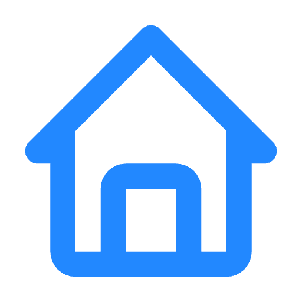

<div align="center">
  <div class="logo-container">
    
  </div>
  
  <!-- Animated Background Styling -->
  <div align="center">
    <a href="https://real-estate-website-sepia-two.vercel.app" target="_blank">
      
    </a>
  </div>
  
  > ### Premium Real Estate Platform with AI-Powered Insights
  
  [](https://reactjs.org/)
  [](https://nodejs.org/)
  [](https://www.mongodb.com/)
  [](https://tailwindcss.com/)
  [](https://www.framer.com/motion/)
  
  <a href="https://buildestate.vercel.app" target="_blank"></a>
  <a href="#%EF%B8%8F-installation"></a>
  <a href="https://github.com/AAYUSH412/Real-Estate-Website/issues/new"></a>
  <a href="#-contributing"></a>
</div>

<div align="center">
  
</div>

<br>

<div align="center">
  
</div>

## ✨ Key Features

<table>
  <tr>
    <td>
      <h3>🏠 User Experience</h3>
      <ul>
        <li>Advanced property search with multiple filters</li>
        <li>Virtual property tours with image galleries</li>
        <li>Secure user authentication system</li>
        <li>Interactive appointment scheduling</li>
        <li>Favorites system with smart lists</li>
        <li>Fully responsive across all devices</li>
      </ul>
    </td>
    <td width="50%">
      
    </td>
  </tr>
  <tr>
    <td>
      <h3>🤖 AI-Powered Analysis</h3>
      <ul>
        <li>Smart property recommendations engine</li>
        <li>Real-time market trend analysis</li>
        <li>Investment insights with ROI predictions</li>
        <li>Property valuation and comparison tools</li>
        <li>Location-based appreciation forecasts</li>
        <li>Dynamic visualization of property data</li>
      </ul>
    </td>
    <td>
      
    </td>
  </tr>
  <tr>
    <td>
      <h3>👩‍💼 Admin Dashboard</h3>
      <ul>
        <li>Comprehensive analytics and reporting</li>
        <li>Property management with bulk operations</li>
        <li>Appointment tracking and management</li>
        <li>User activity monitoring</li>
        <li>Content management system</li>
        <li>Sales performance metrics</li>
      </ul>
    </td>
    <td>
      
    </td>
  </tr>
</table>

<details>
  <summary><h3>🎭 Interactive Animations</h3></summary>
  <br>

  <p>BuildEstate features expertly crafted animations that enhance the user experience:</p>

  <ul>
    <li><strong>Page Transitions:</strong> Smooth fade and slide transitions between routes</li>
    <li><strong>UI Micro-interactions:</strong> Subtle feedback animations for all user actions</li>
    <li><strong>Content Reveal:</strong> Staggered animations for list items and content sections</li>
    <li><strong>Data Visualization:</strong> Progressive chart animations with interactive tooltips</li>
    <li><strong>Image Galleries:</strong> Fluid carousels with zoom capabilities</li>
    <li><strong>Loading States:</strong> Attractive loading skeletons and transitions</li>
  </ul>

  <p>All animations are performance-optimized using Framer Motion's best practices for smooth experiences on all devices.</p>
</details>

## 🛠️ Technology Stack

<div align="center">

### Frontend


### Backend


### AI Services


### DevOps & Deployment


</div>

## 📋 Project Overview

BuildEstate is a modern real estate platform that combines traditional property listing features with cutting-edge AI technology. The platform helps users find their ideal properties while providing valuable investment insights through machine learning algorithms.

The application consists of three main parts:
- **Frontend:** User-facing website with property listings and AI analysis tools
- **Admin Dashboard:** Comprehensive management interface for properties and users
- **Backend API:** Robust Express server with AI-powered data processing

Key differentiators include AI-powered property recommendations, real-time market analysis, and investment opportunity identification, all presented with fluid animations for an exceptional user experience.

## 🚀 Getting Started

### System Requirements

- **Node.js**: v16.0.0 or higher
- **npm** or **yarn**: Latest stable version
- **MongoDB**: v4.4 or higher (local or Atlas)
- **API Keys**: Azure AI, FirecrawlJS, OpenAI (optional)
- **Storage**: At least 500MB free disk space

### ⚙️ Installation

<details>
<summary><b>Step 1: Clone the repository</b></summary>

```bash
git clone https://github.com/AAYUSH412/Real-Estate-Website.git
cd Real-Estate-Website
```
</details>

<details>
<summary><b>Step 2: Environment configuration</b></summary>

Create the following environment files with these required variables:

**Backend (.env)**
```env
PORT=4000
MONGODB_URI=your_mongodb_connection_string
JWT_SECRET=your_jwt_secret
EMAIL=your_email_for_notifications
PASSWORD=your_email_password
AZURE_API_KEY=your_azure_ai_key
FIRECRAWL_API_KEY=your_firecrawl_api_key
NODE_ENV=development
IMAGEKIT_PUBLIC_KEY=your_imagekit_public_key
IMAGEKIT_PRIVATE_KEY=your_imagekit_private_key
IMAGEKIT_URL_ENDPOINT=your_imagekit_url
```

**Frontend (.env.local)**
```env
VITE_API_BASE_URL=http://localhost:4000
```

**Admin (.env.local)**
```env
VITE_BACKEND_URL=http://localhost:4000
```

> 💡 **Note:** For testing without AI services, you can set dummy API keys. The core functionality will work, but AI features will return mock data.
</details>

<details>
<summary><b>Step 3: Install dependencies</b></summary>

```bash
# Install all dependencies with a single command
npm run setup

# Or install each package separately
cd backend && npm install
cd ../frontend && npm install
cd ../admin && npm install
```
</details>

<details>
<summary><b>Step 4: Start development servers</b></summary>

```bash
# Start all services concurrently
npm run dev

# Or start each service separately
cd backend && npm run dev
cd frontend && npm run dev
cd admin && npm run dev
```

This will launch:
- 🌐 **Frontend**: http://localhost:5173
- 👩‍💼 **Admin Panel**: http://localhost:5174
- ⚙️ **Backend API**: http://localhost:4000
</details>

<details>
<summary><b>Step 5: Docker deployment (optional)</b></summary>

For containerized deployment:

```bash
# Build and start all containers
docker-compose up --build

# Or run just the backend
docker-compose up backend
```

Default ports will be mapped to host machine:
- Backend API: http://localhost:4000
- Frontend: http://localhost:3000
- Admin Panel: http://localhost:3001
</details>

<details>
<summary><b>💾 Database setup</b></summary>

The application will automatically set up the MongoDB collections on first run. 

For local development with sample data:
```bash
# Import sample data (from project root)
cd backend
npm run seed
```

This will populate your database with sample properties, users, and appointments.
</details>

<details>
<summary><b>🔑 Default admin credentials</b></summary>

After running the seed script, you can log in to the admin panel with:

- **Email:** admin@buildestate.com
- **Password:** admin123
</details>

## 🧩 Application Structure

```
project/
├── admin/                 # Admin dashboard React app
│   ├── src/
│   │   ├── components/    # Reusable UI components
│   │   ├── contexts/      # Auth and data contexts
│   │   ├── pages/         # Admin dashboard pages
│   │   └── services/      # API service layer
│   └── public/            # Static assets
│
├── backend/               # Express server and API
│   ├── config/            # Server configuration
│   ├── controller/        # Request handlers
│   ├── middleware/        # Express middleware
│   ├── models/            # Mongoose schemas
│   ├── routes/            # API routes
│   ├── services/          # External service integrations
│   └── utils/             # Helper utilities
│
└── frontend/              # User-facing React app
    ├── src/
    │   ├── assets/        # Images and static resources
    │   ├── components/    # UI components
    │   ├── context/       # Application state management
    │   ├── pages/         # Page components
    │   ├── services/      # API client services
    │   └── utils/         # Helper utilities
    └── public/            # Static assets
```

## 📊 Feature Highlights

<div align="center">
  <!-- Animated Stats Section -->
  <div>
    
    
    
  </div>
  <br>
</div>

### Property Search & Discovery

BuildEstate offers a sophisticated property search system with multiple filtering options:

- **Location-based search** with map integration
- **Price range filters** with dynamic market comparison
- **Property type categorization** (apartments, houses, villas, etc.)
- **Amenity-based filtering** with 15+ property features
- **Saved search preferences** for registered users

### AI-Powered Market Analysis

<div align="center">
  
  
</div>

The platform provides valuable insights using multiple AI models:

- **Price trend forecasting** for different neighborhoods
- **Rental yield calculations** based on historical data
- **Investment opportunity scoring** with ROI predictions
- **Neighborhood comparison** with multiple metrics
- **Personalized property recommendations**

All data visualizations feature smooth animations and interactive elements for better understanding.

### User Account Management

The platform offers comprehensive user account features:

- **Secure authentication** with JWT and refresh tokens
- **Profile customization** with saved preferences
- **Favorite properties** with smart categorization
- **Viewing appointment scheduling** and management
- **Email notifications** for account activities and property updates
- **Newsletter subscription** for market updates (opt-in)

## 💌 Newsletter Management

BuildEstate includes a newsletter system for property updates and market trends:

- **Subscription management** via user profile
- **Email preference center** for customizing update frequency
- **Market report delivery** with AI-generated insights
- **One-click unsubscribe** option in all emails
- **GDPR compliant** data storage and processing

> 💡 **Note about privacy:** All user data is stored securely and used only for the purposes explicitly stated in our privacy policy. Users can request data deletion at any time.

## 🛠️ Troubleshooting

<details>
<summary><b>Common Issues & Solutions</b></summary>

### Connection Issues
- **MongoDB Connection Fails**: Check your connection string in .env file and ensure your IP is whitelisted in MongoDB Atlas
- **API Endpoints Returning 404**: Verify the VITE_API_BASE_URL in frontend and admin .env files

### Authentication Problems
- **Admin Login Fails**: Try resetting the admin password using the backend utility:
  ```bash
  cd backend
  npm run reset-admin-password
  ```
- **JWT Token Errors**: Ensure the JWT_SECRET is identical on all deployment environments

### Image Upload Issues
- **Images Not Uploading**: Check ImageKit credentials and connectivity
- **File Size Errors**: Reduce image size to under 5MB

### AI Feature Limitations
- **AI Analysis Not Working**: Verify API keys for Azure and FirecrawlJS
- **Empty Recommendations**: The system needs at least 10 properties in database for meaningful recommendations

For additional help, [open an issue](https://github.com/AAYUSH412/Real-Estate-Website/issues/new) with detailed error information.
</details>

## 🖥️ Screenshots

<table>
  <tr>
    <td></td>
    <td></td>
  </tr>
  <tr>
    <td></td>
    <td></td>
  </tr>
</table>

## 🏆 Project Activity

<div align="center">
  <a href="https://github.com/AAYUSH412/Real-Estate-Website">
    
  </a>
</div>

<br>

<div align="center">
  
</div>

## 🤝 Contributing

We welcome contributions to BuildEstate! Please follow these steps:

1. **Fork the repository**
2. **Create a feature branch:**
   ```bash
   git checkout -b feature/amazing-feature
   ```
3. **Make your changes**
4. **Run tests:**
   ```bash
   npm run test
   ```
5. **Commit your changes:**
   ```bash
   git commit -m 'Add some amazing feature'
   ```
6. **Push to your branch:**
   ```bash
   git push origin feature/amazing-feature
   ```
7. **Open a pull request**

Please read our [Contributing Guidelines](CONTRIBUTING.md) for more details.

### Code Style Standards

- We use ESLint and Prettier for code formatting
- Component-based architecture for UI elements
- Jest for unit testing
- Documentation required for all new features

## 📝 License

This project is licensed under the MIT License - see the [LICENSE](LICENSE) file for details.

## 🌟 Acknowledgements

<div align="center">
  
[](https://reactjs.org/)
[](https://expressjs.com/)
[](https://www.mongodb.com/)
[](https://tailwindcss.com/)
[](https://www.framer.com/motion/)
[](https://lucide.dev/)
  
</div>

Special thanks to all contributors and the open source community.

## 📧 Contact & Support

<div align="center">
  <a href="https://github.com/AAYUSH412"></a>
  <a href="mailto:aayushvaghela12@gmail.com"></a>
  <a href="https://github.com/AAYUSH412/Real-Estate-Website/issues"></a>
</div>

<br>

<div align="center">
  
  <p>Built with ❤️ by Aayush Vaghela</p>
  <p>© 2025 BuildEstate. All Rights Reserved.</p>
</div>
